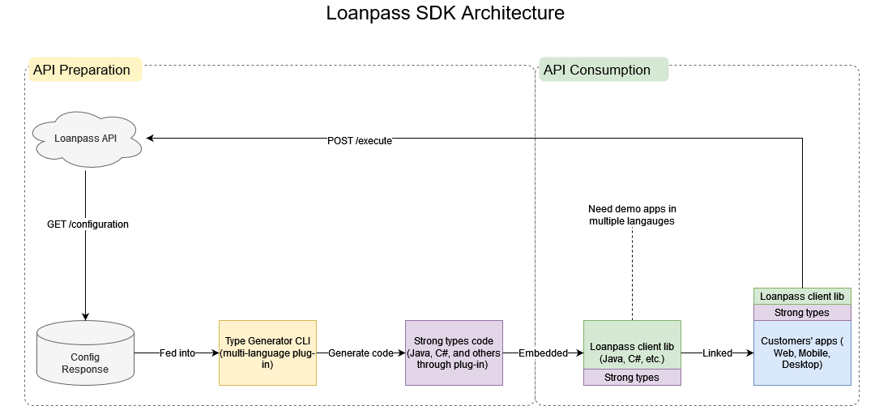

# LoanPass SDK in Multiple Languages

[LoanPass](https://loanpass.io/) is a highly customizable Product Pricing Engine (PPE) with powerfull API. 
Through the SDK here, clients are able to consume LoanPass' API with **a few lines of code in their language of choice for development (C# or Java)**.

Any questions, please contact: [long@take112tango.com](mailto:long@take112tango.com)

The project here consists of 2 components:
- TypeGenerator for multiple languages
- LoanPassSdk (C#)



## TypeGenerator
TypeGenerator is a command line tool developed in C# .NET 5. Using the result of LoanPass' API (/configuration), TypeGenerator generates 
strong typed code containing all the well known **FieldIds** and **EnumIds** of pricing rules.

TypeGenerator was designed to generate strong typed **FieldIds** and **EnumIds** in multiple languages via plug-in(s).
Currently supported languages:
- C# (aka cs)
- Java
- GraphQL (aka gql)

### Getting started
The sample [config_response.json](./TypeGenerator/Samples/config_response.json) used for demonstration and unit testing. 
```
USAGE:
Generate types for all in C#:
  ./Take112Tango.Libs.LoanPassSdk.TypeGenerator.exe --in Samples/config_response.json --language Cs
Generate types for Enum only in C#:
  ./Take112Tango.Libs.LoanPassSdk.TypeGenerator.exe --in Samples/config_response.json --language Cs --targets Enum
Generate types for Field only in Java:
  ./Take112Tango.Libs.LoanPassSdk.TypeGenerator.exe --in Samples/config_response.json --language Java --targets Field
Generate types for Enum and Field in Java:
  ./Take112Tango.Libs.LoanPassSdk.TypeGenerator.exe --in Samples/config_response.json --language Java --targets Enum Field
Generate types for Enum only in GraphQL:
  ./Take112Tango.Libs.LoanPassSdk.TypeGenerator.exe --in Samples/config_response.json --language Gql --targets Enum

  -i, --in          Required. Input json filename

  -l, --language    Required. Set language of generated types

  -t, --targets     Set type definition target(s) of generated types

  -o, --out         Output folder

  --help            Display this help screen.

  --version         Display version information.
```
#### Generate [KnownEnumId.cs](./LoanPassSdk/Generated/KnownFieldId.cs)
```
./Take112Tango.Libs.LoanPassSdk.TypeGenerator.exe -i "Samples\config_response.json" -l cs -t enum
```
#### Output in C#
``` C#
// This source code was auto-generated in 12/30/2021 07:04:46
// 
namespace Take112Tango.Libs.LoanPassSdk.Generated
{
    /// <summary>
    /// Field definitions auto generated from LoanPass API for strong type checking
    /// </summary>
    [GeneratedCode("Take112Tango.Libs.LoanPassSdk.TypeGenerator.CodeGen.CS.EnumDefCodeGen", "1.0.0.0")]
    [JsonConverter(typeof(StringEnumConverter))]
    public enum KnownEnumId
    {
        [EnumMember(Value = "loan-purpose")]
        [TextTags("VariantIds", "purchase", "refinance", "assumption", "mortgage-modification")]
        LOAN_PURPOSE
        , [EnumMember(Value = "channel")]
        [TextTags("VariantIds", "correspondent", "wholesale")]
        CHANNEL

    }
    ...
```
#### Generate KnownFieldId.java
```
./Take112Tango.Libs.LoanPassSdk.TypeGenerator.exe -i "Samples\config_response.json" -l java -t field
```
#### Output in Java
``` Java
...
@Getter
@ToString
@JsonSerialize(using = ValueObservableSerializer.class)
@javax.annotation.Generated(value="Take112Tango.Libs.LoanPassSdk.TypeGenerator.CodeGen.Java.FieldDefCodeGen", date="12/30/2021 04:15:04")
/**
 * This source code was auto-generated in 12/30/2021 04:15:04
 * Field definitions auto generated from LoanPass API for strong type checking
 */
public enum KnownFieldId implements ValueObservable<String> {
    //Count: 5
	DESIRED_LOAN_TERM ("field@desired-loan-term", Duration)
	,AFTER_REPAIR_VALUE_ARV ("field@after-repair-value-arv", Number)
	,BASE_LOAN_AMOUNT ("field@base-loan-amount", Number)
	,STATE ("field@state", String)
	,LOAN_PURPOSE ("field@loan-purpose", Enum, "loan-purpose");
    ...
}
```

In addition, TypeGenerator can also generate GraphQL schema containing all the well known EnumIds of client's pricing rules.

#### Generate KnownEnumId.graphqls
```
./Take112Tango.Libs.LoanPassSdk.TypeGenerator.exe -i "Samples\config_response.json" -l gql -t enum
```
#### Output in GraphQL schema
```
# This source code was auto-generated in 12/30/2021 07:04:46
# Take112Tango.Libs.LoanPassSdk.TypeGenerator.CodeGen.GQL.EnumDefCodeGen, 1.0.0.0

enum LOAN_PURPOSE {
	PURCHASE
	REFINANCE
	ASSUMPTION
	MORTGAGE_MODIFICATION
}
```

## LoanPass SDK in C#
SDK for C# is part of this project. **Prior to embedding the SDK into clients' code, TypeGenerator needs to be run 
to update [KnownEnumId.cs](./LoanPassSdk/Generated/KnownFieldId.cs) and [KnownFieldId.cs](./LoanPassSdk/Generated/KnownFieldId.cs) of the SDK project with the latest result of LoanPass' API (/configuration).**
Please see the [Loanpass SDK Architecture](docs/LoanpassSDK.png).

### Getting started
The [FieldsBuilder](./LoanPassSdk/Builders/ExecSummaryRequestBuilder.cs) in the sample code below builds and validates individual fields of the request using strong typed FieldIds and EnumIds generated 
by TypeGenerator.

```C#
// Initialize
var settings = new Settings(LOANPASS_API_KEY); //Bearer...Put your API key from LoanPass here
var client = new LoanPassClient(settings);

// API - GET /configuration 
var configResult = await client.GetConfigurationAsync();

// API - POST /execute-summary
var summaryFields = ExecSummaryRequest.FieldsBuilder()
                .FieldEnum(KnownFieldId.LOAN_PURPOSE, "purchase")
                .FieldNumber(KnownFieldId.BASE_LOAN_AMOUNT, 12)
                .FieldString(KnownFieldId.STATE, "ca")
                .FieldDuration(KnownFieldId.DESIRED_LOAN_TERM, 30, DurationUnit.Years)
                .Build();

var summaryRequest = ExecSummaryRequest.Builder()
                .WithTime(DateTime.Now)
                .WithFields(summaryFields)
                .Build();
                
var summaryResult = await client.ExecSummaryAsync(summaryRequest);

// API - POST /execute-product
var productFields = ExecProductRequest.FieldsBuilder()
                .FieldEnum(KnownFieldId.LOAN_PURPOSE, "purchase")
                .FieldNumber(KnownFieldId.BASE_LOAN_AMOUNT, 12)
                .FieldString(KnownFieldId.STATE, "ca")
                .FieldDuration(KnownFieldId.DESIRED_LOAN_TERM, 30, DurationUnit.Years)
                .Build();

var productRequest = ExecProductRequest.Builder()
                .WithTime(DateTime.Now)
                .WithFields(fields)
                .WithProdId("some product id")
                .Build();
                
var productResult = await client.ExecProductAsync(productRequest);
```


## LoanPass SDK in Java
SDK for Java is available from another open-source project [here](https://github.com/youlandinc/loanpass-sdk-java).

## LoanPass SDK in TypeScript/Python/Go 
TBA

## License summary
Apache 2.0